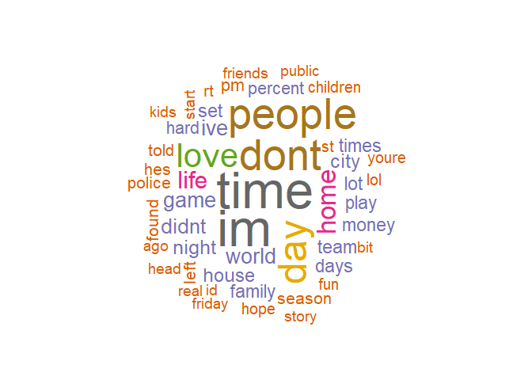
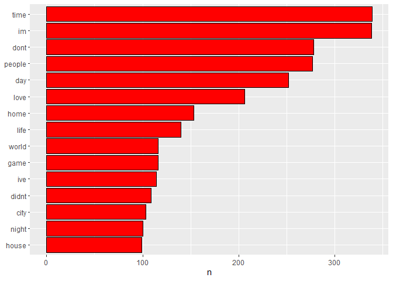

Data Science Capstone
================
Andres Fernando Garcia
3/31/2021

## Overview

The goal of this project is to get familiar with the databases of text,
perform a summary of the data and do the necessary cleaning. Large
databases comprising of text in a target language are commonly used when
generating language models for various purposes. The databases was
obtained from news, blogs and twitter.

In first instance the data must be cleaned to later analyze what words
appear more frequently. The clean process consist on:

1.  Convert to lowercase all letters
2.  Erase the punctuation
3.  Erase each number
4.  Remove any english empty word
5.  Clean the white spaces

After this, the most frequented word are showed on a wordcloud using the
wordcloud library. On this kind of graphs, the size of the word depends
of the frequency that it appears on the databases. More frequent the
word, more bigger it will be shown on the graph.

## Loading the data and showing summary values

``` r
# Loading libraries

#
# Checking if the data was previously downloaded
source("./R/get_data.R", local = knitr::knit_global())
```

    ## [1] "The dataset was previously downloaded"

``` r
#
# Loading the data into the workspace
twitter <- readLines("./final/en_US/en_US.twitter.txt", 
                     encoding = "UTF-8", skipNul = T)
blogs   <- readLines("./final/en_US/en_US.blogs.txt", 
                     encoding = "UTF-8", skipNul = T)
news    <- readLines("./final/en_US/en_US.news.txt", 
                     encoding = "UTF-8", skipNul = T)
```

## Samplig the data to save memory

``` r
# for reproducibility
set.seed(1525)
#
nsamples = 2000
#
# Sampling the data
twitter <- sample(twitter, nsamples)
blogs   <- sample(blogs, nsamples)
news    <- sample(news, nsamples)
#
sData <- c(twitter, blogs, news)
```

In order to turn it into a tidy text dataset, we first need to put it
into a data frame.

``` r
library(dplyr)
text_df <- tibble(text = sData)
```

## Cleaning data

Create filters: stopwords, profanity, non-alphanumeric’s, url’s,
repeated letters(+3x).

``` r
data(stop_words)
library(readr)
library(tidytext)
library(stringr)
#
# Remove profanities - list from http://www.bannedwordlist.com/lists/swearWords.csv, and stored in final/en_US folder
profanities <- read_delim("./final/en_US/swearWords.csv", delim = "\n", col_names = FALSE)

profanities <- unnest_tokens(profanities, word, X1)
replace_reg <- "[^[:alpha:][:space:]]*"
replace_url <- "http[^[:space:]]*"
replace_aaa <- "\\b(?=\\w*(\\w)\\1)\\w+\\b"  

text_df <- text_df %>%
  mutate(text = str_replace_all(text, replace_reg, "")) %>%
  mutate(text = str_replace_all(text, replace_url, "")) %>%
  mutate(text = str_replace_all(text, replace_aaa, "")) %>% 
  mutate(text = iconv(text, "ASCII//TRANSLIT"))
```

## Transform the text to a tidy data structure

Removing stop words:

``` r
unigram <- text_df %>%
  unnest_tokens(word, text) %>%
  anti_join(profanities) %>%
  anti_join(stop_words)
```

``` r
bigram <- text_df  %>%
  unnest_tokens(bigram, text, token = "ngrams", n = 2)
```

``` r
trigram <- text_df  %>%
  unnest_tokens(trigram, text, token = "ngrams", n = 3)
```

``` r
quadgram <- text_df  %>%
  unnest_tokens(quadgram, text, token = "ngrams", n = 4)
```

## Finding the most common words of unigrams

``` r
library(wordcloud)
pal <- brewer.pal(8,"Dark2")
unigram %>%
  count(word) %>%
  with(wordcloud(word, n, random.order = FALSE, max.words = 50, colors=pal))
```

<!-- -->

## creating a visualization of the frequency of most common words

``` r
library(ggplot2)

p <- unigram %>%
  count(word, sort = TRUE) %>%
  filter(n > 50) %>%
  mutate(word = reorder(word, n)) %>%
  head(15) %>%
  ggplot(aes(n, word)) +
  geom_col(colour="black", fill="red") +
  labs(y = NULL)
p
```

<!-- -->

## Counting and filtering n-grams

Bigrams:

``` r
library(tidyr)

bigram_counts <- bigram %>%
  separate(bigram, c("word1", "word2"), sep = " ") %>%
  # filter(!word1 %in% stop_words$word) %>%
  # filter(!word2 %in% stop_words$word) %>%
  # filter(!word1 %in% profanities$word) %>%
  # filter(!word2 %in% profanities$word) %>%
  count(word1, word2, sort = TRUE)

# recombined  bigrams
# bigrams_united <- bigrams_filtered %>%
#   unite(bigram, word1, word2, sep = " ")
```

Trigrams:

``` r
trigrams_counts <- trigram %>%
  separate(trigram, c("word1", "word2", "word3"), sep = " ") %>%
  # filter(!word1 %in% stop_words$word,
  #        !word2 %in% stop_words$word,
  #        !word3 %in% stop_words$word,
  #        !word1 %in% profanities$word,
  #        !word2 %in% profanities$word,
  #        !word3 %in% profanities$word,) %>%
  count(word1, word2, word3, sort = TRUE)
```

Quadgrams:

``` r
quadgrams_counts <- quadgram %>%
  separate(quadgram, c("word1", "word2", "word3", "word4"), sep = " ") %>%
  # filter(!word1 %in% stop_words$word,
  #        !word2 %in% stop_words$word,
  #        !word3 %in% stop_words$word,
  #        !word4 %in% stop_words$word,
  #        !word1 %in% profanities$word,
  #        !word2 %in% profanities$word,
  #        !word3 %in% profanities$word,
  #        !word4 %in% profanities$word,) %>%
  count(word1, word2, word3, word4, sort = TRUE)
```

Quintgrams:

``` r
quintgrams_counts <- text_df  %>%
  unnest_tokens(quintgram, text, token = "ngrams", n = 5) %>%
  separate(quintgram, c("word1", "word2", "word3", "word4", "word5"), sep = " ") %>%
  # filter(!word1 %in% stop_words$word,
  #        !word2 %in% stop_words$word,
  #        !word3 %in% stop_words$word,
  #        !word4 %in% stop_words$word,
  #        !word5 %in% stop_words$word,
  #        !word1 %in% profanities$word,
  #        !word2 %in% profanities$word,
  #        !word3 %in% profanities$word,
  #        !word4 %in% profanities$word,
  #        !word5 %in% profanities$word,) %>%
  count(word1, word2, word3, word4, word5, sort = TRUE)
```

Sextgrams:

``` r
sextgrams_counts <- text_df  %>%
  unnest_tokens(sextgram, text, token = "ngrams", n = 6) %>%
  separate(sextgram, c("word1", "word2", "word3", "word4", "word5", "word6"), sep = " ") %>%
  # filter(!word1 %in% stop_words$word,
  #        !word2 %in% stop_words$word,
  #        !word3 %in% stop_words$word,
  #        !word4 %in% stop_words$word,
  #        !word5 %in% stop_words$word,
  #        !word6 %in% stop_words$word,
  #        !word1 %in% profanities$word,
  #        !word2 %in% profanities$word,
  #        !word3 %in% profanities$word,
  #        !word4 %in% profanities$word,
  #        !word5 %in% profanities$word,
  #        !word6 %in% profanities$word,) %>%
  count(word1, word2, word3, word4, word5, word6, sort = TRUE)
```

## Reduce n-grams files

``` r
# Bigrams
bigram_counts <- bigram_counts %>%
  filter(n > 10) %>%
  arrange(desc(n))  

# Trigrams
trigrams_counts <- trigrams_counts %>%
  filter(n > 10) %>%
  arrange(desc(n)) 

# # Quadgrams
# quadgrams_counts <- quadgrams_counts %>%
#   filter(n > 10) %>%
#   arrange(desc(n)) 
# 
# # Quintgrams
# quintgrams_counts <- quintgrams_counts %>%
#   filter(n > 10) %>%
#   arrange(desc(n)) 
# 
# # Sextgrams
# sextgrams_counts <- sextgrams_counts %>%
#   filter(n > 10) %>%
#   arrange(desc(n)) 
```
